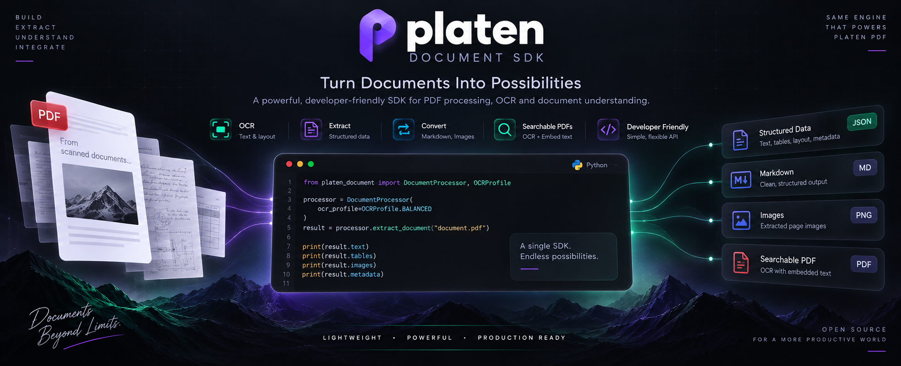

# platen-document

**A local-first Python SDK for PDF processing, OCR, document extraction, searchable PDFs, Markdown conversion, and PDF markup.**

`platen-document` is a standalone document-processing SDK extracted from
PDFNest's OCR V2 engine.

It runs locally and does not require the PDFNest backend, PostgreSQL, Redis,
Dramatiq, authentication, billing, HTTP services, or application storage.

## Features

- Native PDF text extraction
- Automatic native/scanned-page routing
- Local Tesseract OCR
- Explicit OCR language selection
- Structured document extraction
- Word, line, block, and reading-order results
- Headings, lists, and bounded table extraction
- Markdown rendering
- Searchable PDF generation with invisible OCR text
- Highlight, Underline, and Strikeout markup
- Region-based PDF annotation
- OCR-aware region markup
- Extraction provenance and validation metadata
- Cooperative cancellation and progress callbacks
- Local environment and capability diagnostics

---

## Installation

`platen-document` requires **Python 3.12 or newer**.

Install the SDK from PyPI:

```bash
pip install platen-document
```

### System dependency

OCR features require a local **Tesseract OCR** installation.

On Ubuntu/Debian:

```bash
sudo apt update
sudo apt install tesseract-ocr
```

Additional Tesseract language packs can be installed separately when needed.

Verify the SDK and your local OCR environment:

```bash
platen-document doctor
```

---

## Quick start

```python
from platen_document import DocumentProcessor

processor = DocumentProcessor()

# Extract text
text_result = processor.extract_text("document.pdf")
print(text_result.text)

# Extract structured document data
document = processor.extract_document("document.pdf")

# Convert structured output to Markdown
markdown = processor.to_markdown(document)
print(markdown)

# Create a searchable PDF from a scanned document
processor.make_searchable_pdf(
  "scanned.pdf",
  "scanned-searchable.pdf",
)
```

---

## Core workflows

### Text extraction

```python
from platen_document import DocumentProcessor

processor = DocumentProcessor()

result = processor.extract_text("document.pdf")

print(result.text)
```

The default routing behavior preserves validated native PDF text when
appropriate and uses OCR when required.

---

### Structured document extraction

```python
from platen_document import DocumentProcessor

processor = DocumentProcessor()

document = processor.extract_document("document.pdf")
```

Structured extraction can include canonical document elements such as:

- words;
- lines;
- blocks;
- reading order;
- headings;
- lists;
- simple tables;
- provenance metadata; and
- validation results.

---

### Markdown conversion

```python
from platen_document import DocumentProcessor

processor = DocumentProcessor()

document = processor.extract_document("document.pdf")
markdown = processor.to_markdown(document)

print(markdown)
```

---

### Searchable PDFs

Scanned PDFs can be converted into searchable PDFs by rendering invisible OCR
text over the original pages.

```python
from platen_document import DocumentProcessor

processor = DocumentProcessor()

processor.make_searchable_pdf(
  "scanned.pdf",
  "scanned-searchable.pdf",
)
```

Applications that need the canonical searchable-PDF profile can extract once
and reuse the result during rendering:

```python
from platen_document import DocumentProcessor, OCRProfile

processor = DocumentProcessor()

result = processor.extract_text(
  "scanned.pdf",
  profile=OCRProfile.SEARCHABLE_PDF_V2,
)

processor.make_searchable_pdf(
  "scanned.pdf",
  "scanned-searchable.pdf",
  result=result,
  job_id="optional-diagnostic-correlation",
)
```

Passing the existing result avoids performing a second OCR pass.

---

## OCR routing and execution controls

`extract_text()` supports the engine's routing policy together with optional
cooperative execution controls such as:

- `cancellation_check`;
- `page_timeout_seconds`;
- `page_progress_callback`; and
- explicit OCR routing.

The default routing policy preserves validated native text when appropriate.

Applications that require OCR-only behavior can explicitly select:

```python
result = processor.extract_text(
  "document.pdf",
  routing_policy="FORCE_OCR",
)
```

`FORCE_OCR` changes the selected route without changing the SDK's default
behavior for other consumers.

The SDK exposes these controls for application adapters but does not own
application jobs, queues, or persistent storage.

---

## Scanned table recognition

For upright scanned pages containing clear ruled tables, bounded table-aware
structured extraction can be enabled explicitly.

```python
from platen_document import (
  DocumentProcessor,
  EngineConfiguration,
)

processor = DocumentProcessor(
  EngineConfiguration(
    enable_scanned_table_recognition=True,
  )
)

structured = processor.extract_document(
  "scanned-table.pdf"
)
```

This path removes detected long ruling lines before the same OCR pass and
reconstructs conservative aligned numeric rows.

It is designed for bounded, clearly structured scanned tables rather than
arbitrary table recognition.

The feature is disabled by default:

```python
enable_scanned_table_recognition=False
```

This keeps the default OCR and structured-extraction behavior stable for
existing consumers.

---

## Region-based markup

`DocumentProcessor.apply_markup_regions()` supports typed, one-based page
regions in the existing visible CropBox-relative PDF-point coordinate space.

Supported workflows include:

- manual region annotation;
- OCR-aware region annotation;
- Highlight;
- Underline;
- Strikeout;
- per-region colors;
- cooperative cancellation;
- progress callbacks; and
- reuse of an existing `DocumentResult`.

Manual regions can be annotated without OCR.

OCR-aware regions can reuse an existing public `DocumentResult` to avoid a
second extraction pass. If no result is supplied, the SDK can perform one
public `extract_text()` pass.

See:

[Region markup API guide](docs/region_markup.md)

for the complete coordinate, password, result, overlap, and geometry contract.

### Region geometry

Version `0.1.1` fixed native rotated-page region selection without changing
the public visible-region API or OCR/scanned geometry behavior.

Version `0.1.2` extended the same coordinate contract to manual region
annotation.

Visible input rectangles are mapped exactly once into canonical PDF coordinates
at the PyMuPDF writer boundary.

Native PyMuPDF word boxes remain in unrotated PDF coordinates, while OCR boxes
retain their existing visible-space behavior.

---

## Configuration

Python dependencies are declared in `pyproject.toml`.

The SDK discovers the local Tesseract executable, tessdata directory, and
installed language packs.

It does **not** install operating-system packages or download OCR models.

Custom paths can be configured explicitly:

```python
from platen_document import (
  DocumentProcessor,
  EngineConfiguration,
)

processor = DocumentProcessor(
  EngineConfiguration(
    tesseract_binary="/usr/bin/tesseract",
    tessdata_dir="/usr/share/tesseract-ocr/5/tessdata",
  )
)
```

The engine also retains its tessdata fallback behavior, including fallback from
a stale `TESSDATA_PREFIX` when a known local system directory is available.

---

## Raster DPI metadata

OCR raster images normally contain the configured DPI in their PNG metadata.

Applications that need to reproduce a historical OCR input contract can use the
public compatibility policy:

```python
from platen_document import (
  DocumentProcessor,
  EngineConfiguration,
  RasterDpiMetadataPolicy,
)

processor = DocumentProcessor(
  EngineConfiguration(
    raster_dpi=144,
    raster_dpi_metadata_policy=(
      RasterDpiMetadataPolicy.OMIT_DPI
    ),
  )
)
```

The default is:

```python
RasterDpiMetadataPolicy.EMBED_DPI
```

`OMIT_DPI` changes only the encoded PNG DPI metadata.

It does not change:

- raster dimensions;
- rendered pixels;
- page geometry;
- OCR language selection; or
- routing policy.

This option is intended for consumer-specific compatibility requirements.

---

## Diagnostics

Inspect the local SDK environment with:

```bash
platen-document doctor
```

The command reports safe local capability metadata such as OCR and runtime
availability.

It does not know about PDFNest:

- users;
- guests;
- quotas;
- jobs;
- queues;
- storage providers;
- authentication;
- billing; or
- application secrets.

Capabilities can also be inspected programmatically:

```python
from platen_document import DocumentProcessor

processor = DocumentProcessor()

capabilities = processor.capabilities()

print(capabilities)
```

---

## Local-first architecture

`platen-document` is intentionally independent of the PDFNest application
runtime.

The SDK can process local documents without:

```text
PDFNest backend
PostgreSQL
Redis
Dramatiq
Frontend services
HTTP APIs
Authentication
Billing
Cloud storage
Application job orchestration
```

Applications remain responsible for concerns such as:

- authentication;
- authorization;
- quotas;
- rate limits;
- durable job orchestration;
- storage;
- cleanup;
- API routes; and
- user interfaces.

This keeps the SDK usable as a standalone document-processing library.

---

## PDFNest integration

PDFNest uses independent execution boundaries that allow document-processing
consumers to select between its internal implementation and this SDK.

Current integration boundaries include:

- OCR Text V2 — `OCR_TEXT_ENGINE`
- Searchable PDF V2 — `SEARCHABLE_PDF_ENGINE`
- Document Extraction V2 — `DOCUMENT_EXTRACTION_ENGINE`
- PDF-to-Markdown V2 — `PDF_TO_MARKDOWN_ENGINE`
- OCR-aware Highlight / Underline / Strikeout — `OCR_MARKUP_ENGINE`
- General Editor OCR — `EDITOR_OCR_ENGINE`

Each selector keeps its own application-level execution boundary.

The SDK itself does not contain PDFNest application routing, authentication,
quota, billing, or storage logic.

---

## Project status

`platen-document` is currently in the `0.1.x` release series.

These releases prioritize compatibility and parity with the validated OCR V2
engine from which the SDK was extracted.

The default detector, rendering behavior, routing policy, and validation
contracts are intentionally kept conservative.

New capabilities that can materially change extraction behavior are introduced
as explicit opt-in features where appropriate.

---

## Development

Clone the repository:

```bash
git clone https://github.com/gimesha-adikari/platen-document.git
cd platen-document
```

Create a virtual environment:

```bash
python3 -m venv .venv
source .venv/bin/activate
```

Install the project with development dependencies:

```bash
pip install -e ".[dev]"
```

Run the test suite:

```bash
pytest
```

Build distributions:

```bash
python -m build
```

The generated wheel and source distribution will be placed in:

```text
dist/
```

---

## Requirements

- Python 3.12+
- Tesseract OCR
- PyMuPDF
- Pillow
- pdfplumber

---

## License

Licensed under the **Apache License 2.0**.